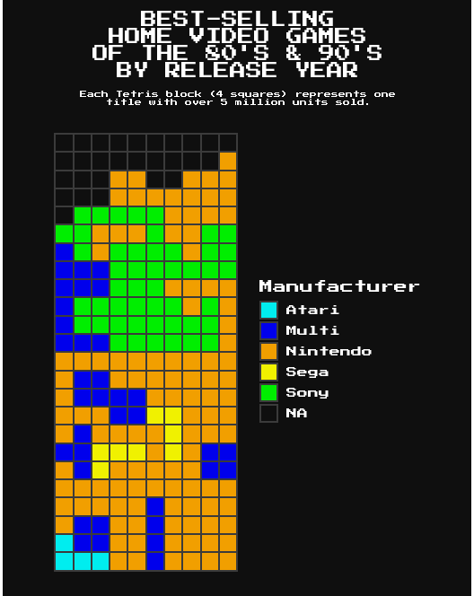

```{r setup, include=FALSE}
knitr::opts_chunk$set(echo = TRUE)
```

A function to create a Tetris-themed plot using ggplot2's geom_col.



## Data

* Turns_separated.csv : template used to place Tetris-themed blocks into the chart

## Use

This plot format is very limited for practical use, and is best used to count occurrences of factors in very small datasets (<100 rows).

Clone and run <a href="https://github.com/filmicaesthetic/TetrisChart/blob/main/scripts/blocks_plot.R">blocks_plot.R</a> and use blocks_plot() to plot data.

``` {r tetris_plot, message = FALSE, eval = FALSE, warning = FALSE}
tetris_plot(data = NULL, count_col = NULL, bgcolor = "#ffffff", blockcolor = "#394d6e")
```

### Arguments

* data : The data to use for the plot
* count_col : The name of column to plot
* bgcolor : colour of plot background
* blockcolor : colour of plot grid lines

Example:

``` {r example, message = FALSE, eval = FALSE, warning = FALSE}
tetris_plot(data = df, count_col = col_5, bgcolor = "#000000", blockcolor = "grey")
```

## Issues

* Currently has trouble outputting with ggsave

